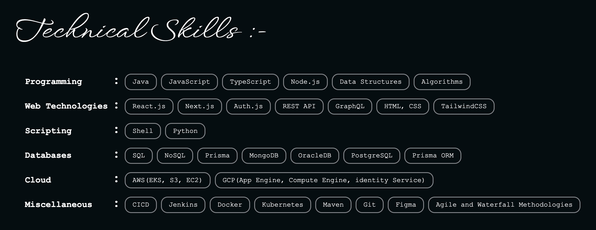

# Hi there 👋

<ul class="card-list">
    <li>I am <b class="important-info">Aditya Sanjay Dhage! 👋🏻</b></li>
    <li><b class="important-info">📍</b class="important-info"> Based in - <b class="important-info">Los Angeles 🇺🇸</b>, California</li>
    <li>I am <b class="important-info">28 years old 🤓</b>, born on <b class="important-info">31st October 🎂 🎃 👻</b></li>
    <li>Originally from Pune, Maharashtra, <b class="important-info">India 🇮🇳</b></li>
    <li><b class="important-info">Software Developer 💻</b>, By Profession</li>
    <li><b class="important-info">📚 Master of Science - Computer Science</b> from USC (December 2024)</li>
    <li><b class="important-info">📚 Bachelor of Engineering - Computer Engineering</b> from Pune University (June 2018)</li>
    <li>Current interests include :
        <ul>
            <li style="padding-left: 1rem; list-style: circle;">Full-Stack Software Development</li>
            <li style="padding-left: 1rem; list-style: circle">Web Applications Development</li>
            <li style="padding-left: 1rem; list-style: circle;">Java, JavaScript and TypeScript Programming</li>
            <li style="padding-left: 1rem; list-style: circle;">Data Structures, Algorithms, and Problem Solving</li>
            <li style="padding-left: 1rem; list-style: circle;">Building software solutions for real-world problems</li>
        </ul>
    </li>
</ul>

<!--
**adi-sd/adi-sd** is a ✨ _special_ ✨ repository because its `README.md` (this file) appears on your GitHub profile.

Here are some ideas to get you started:

- 🔭 I’m currently working on ...
- 🌱 I’m currently learning ...
- 👯 I’m looking to collaborate on ...
- 🤔 I’m looking for help with ...
- 💬 Ask me about ...
- 📫 How to reach me: ...
- 😄 Pronouns: ...
- ⚡ Fun fact: ...
-->
